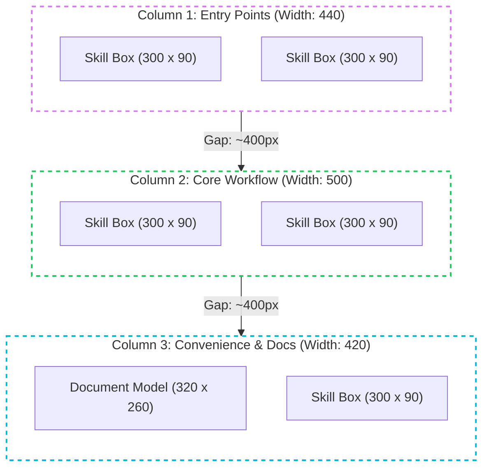

# Excalidraw Design Style Guide

This style guide documents the visual standards, layout geometry, color systems, and typographic rules used in the SpekLess Skills and Workflow Architecture diagram. It serves as a reference for creating future Excalidraw diagrams—both manually and programmatically via scripts or agents—to maintain a unified, premium visual language.

---

## 1. Visual Theme & Color Palette

The diagram uses a modern **Dark Theme** to ensure vibrant colors stand out. All colors follow a cohesive HSL-mapped palette.

### General Theme
- **Canvas Background**: Solid dark grey/black (`#1e1e1e`).
- **Accent Text Color**: White (`#ffffff`) for filled labels and annotations.

### Column-Specific Accent Colors
The layout is divided into three distinct columns, each with a corresponding accent color:

| Column | Purpose | Accent Hex | Header BG | Header Text | Frame Style |
| :--- | :--- | :--- | :--- | :--- | :--- |
| **Column 1** | Entry Points | `#da77f2` (Light Purple) | `#da77f2` | `#f3f0ff` | Dashed, Opacity 50% |
| **Column 2** | Core Workflow | `#22c55e` (Emerald Green) | `#40c057` | `#ebfbee` | Dashed, Opacity 50% |
| **Column 3** | Docs & Conv. | `#06b6d4` (Cyan Blue) | `#06b6d4` | `#e3fafc` | Dashed, Opacity 50% |

### Relationship / Loopback Accents
- **Commit Actions**: `#06b6d4` (Cyan Blue is used for `/spek:commit` connections and badges.
- **Re-plan Loops**: `#f59e0b` (Amber Orange) represents feedback loops to the planning stage.
- **Fix Loops**: `#ef4444` (Coral Red) indicates error/issue resolution loops.

---

## 2. Layout Geometry & Spacing

To keep the diagram feeling **airy and readable**, columns are spaced wide apart to leave ample room for curved connection paths and annotation badges.



### Dimensions & Positions Reference

| Element Type | Width (px) | Height (px) | Corner Roundness | Stroke / Fills |
| :--- | :--- | :--- | :--- | :--- |
| **Column 1 Outer Frame** | 440 | 1102.87 | Rounded (`type: 3`) | Dashed, Stroke: `#da77f2`, BG: `transparent`, Opacity: 50% |
| **Column 2 Outer Frame** | 500 | 1102.87 | Rounded (`type: 3`) | Dashed, Stroke: `#22c55e`, BG: `transparent`, Opacity: 50% |
| **Column 3 Outer Frame** | 420 | 1102.87 | Rounded (`type: 3`) | Dashed, Stroke: `#06b6d4`, BG: `transparent`, Opacity: 50% |
| **Header Badges (All)** | Frame Width | 60 | Rounded (`type: 3`) | Solid Fill, Stroke: Accent, BG: Accent |
| **Skill Boxes (All)** | 300 | 90 | Rounded (`type: 3`) | Solid stroke, Stroke: Accent, BG: `transparent` |
| **Document Model Box** | 320 | 260 | Rounded (`type: 3`) | Solid stroke, Stroke: `#06b6d4`, BG: `transparent` |
| **Document Files Sub-boxes**| 280 | 35 | Rounded (`type: 3`) | Solid stroke, Stroke: `#06b6d4`, BG: `transparent` |
| **Annotation Badges (All)** | Dynamic | 30 | Rounded (`type: 3`) | Solid Fill, Stroke: Accent, BG: Accent, Opacity: 100% |

### Spacing Rules
- **Horizontal Column Gaps**: Spaced at **~400px** gaps (Column 1 is centered at `X = 190`, Column 2 at `X = 1055`, and Column 3 at `X = 1915`) to provide clear visual boundaries.
- **Vertical Skill Box Gaps**: Spaced vertically at **170px** intervals (top-to-top), which leaves an **80px** gap between the bottom of one box and the top of the next.
- **Document Sub-boxes Vertical Gaps**: Spaced vertically at **45px** intervals (top-to-top), creating a clean **10px** gap between the file containers.

---

## 3. Typography & Text Standards

Typography uses a clean, modern sans-serif typeface to maintain high readability against the dark background.

- **Font Family**: Index `8` (represents a custom loaded font such as *Outfit* or *Nunito*).
- **Text Alignment**: Centered (`textAlign: "center"`) for all headers, titles, and descriptions.
- **Text Styling**:
  - **Column Headers**: `28px` font size, ALL CAPS, colored matching the header accent.
  - **Skill Names**: `20px` font size, colored matching the column accent.
  - **Skill Subtitles (Descriptions)**: `16px` font size, enclosed in brackets (e.g. `[Greenfield]`), colored matching the column accent.
  - **Annotation Badge Text**: `16px` font size, White (`#ffffff`), centered within their solid colored background.

---

## 4. Grouping & Selection Structure

To prevent layout drift when moving elements in the Excalidraw editor, shapes and their corresponding texts are strictly grouped together in the JSON using `groupIds`.

- **Skill Groups**: Every skill container consists of three elements grouped together:
  1. The outer box rectangle (`300` x `90`).
  2. The skill command text (`20px`).
  3. The bracketed explanation text (`16px`).
- **Badge Groups**: Every annotation badge consists of two elements grouped together:
  1. The solid filled rounded rectangle background (`width` x `30`).
  2. The label text (`16px`, white).
- **Document Model Group**: The `SpekLess Document Model` title text is kept independent, while each nested document file consists of:
  1. The file rectangle (`280` x `35`).
  2. The file label text (`16px`, cyan).

---

## 5. Connection Arrows & Curves

Arrows represent relationships, query calls, and state transitions. Their stroke styles and roundness define their function:

```
        Straight Transitions (Solid, Green, Width 2, Roundness: None)
                       [Skill A] ===> [Skill B]
                       
        Connection Splines (Solid, Purple, Width 2, Roundness: Bezier Spline)
                       [Skill A] ~~~~\
                                      \===> [Skill B]
                                      
        Dashed Queries (Dashed, Cyan, Width 1.5, Roundness: Bezier Spline)
                       [Skill A] - - - \
                                        - - - ===> [Document Model]
```

- **Sequential Downward Steps**: Represented as straight vertical arrows (`strokeStyle: "solid"`, `strokeWidth: 2`, `strokeColor: "#22c55e"`, `roundness: None`).
- **Inter-column Transitions**: Represented as smooth bezier curves (`strokeStyle: "solid"`, `strokeWidth: 2`, `roundness: {"type": 2}`) with multi-point coordinate arrays (Catmull-Rom splines) to create elegant, non-overlapping curves.
- **Document Queries/Queries**: Represented as dashed curved arrows (`strokeStyle: "dashed"`, `strokeWidth: 1.5`, `strokeColor: "#06b6d4"`, `roundness: {"type": 2}`).
- **Loops / feedback paths**: Dashed curved arrows (`strokeWidth: 2`, colors `#ef4444` or `#f59e0b`) showing feedback directions.

---

## 6. Troubleshooting: Text Visibility Root Causes & Coding Guidelines

During early diagram generation, text elements frequently became invisible or wrapped awkwardly. The investigation revealed the following:

### Root Causes
1. **Collapsing Box Dimensions**: Excalidraw JSON files do not auto-render text sizes on load if `width` and `height` properties are omitted or set to `0`. If they are missing, the Excalidraw editor initializes the element box to `0` x `0` pixels, collapsing the text and rendering it completely invisible.
2. **Font Layout Discrepancies**: The Nunito/Outfit font engine has wider bounding boxes for uppercase characters compared to lowercase characters.
3. **Truncation and Wrapping**: If a text element's bounding `width` is too narrow, the Excalidraw client auto-wraps the text to a second line. If the bounding `height` is restricted to a single line, the wrapped text slips out of the bounding box and gets cut off.

### Programmatic Guidelines
To programmatically generate text elements that are 100% visible, centered, and correctly sized, you must implement the following logic in your scripts:

1. **Calculate Character Width Factors**:
   - Mixed-case text: Assume an average character width of **`0.60 * fontSize`**.
   - All-uppercase text: Assume an average character width of **`0.70 * fontSize`**.
2. **Apply Bounding Padding**:
   - Calculate the estimated width as `len(text) * fontSize * factor`.
   - Add a safety padding of **`40px`** to the width: `width = est_width + 40`. This acts as a buffer against client font-rendering differences and prevents auto-wrapping.
   - Set the bounding height to **`1.4 * fontSize`** to accommodate character ascenders and descenders.
3. **Precise X-Centering**:
   - To center the text element box at a target coordinate `cx`, compute the top-left coordinate as: `x = cx - est_width / 2`.

### Python Helper Code for Programmatic Generation
Here is the recommended Python function to use when generating Excalidraw JSON text elements programmatically:

```python
def add_text_element(element_id, cx, y, text, font_size, color, font_family=8, group_ids=None):
    """
    Generates a properly padded and centered Excalidraw text element dictionary
    to guarantee full visibility and prevent text clipping or wrapping.
    """
    # Determine the character width factor based on casing
    is_upper = text.isupper()
    factor = 0.70 if is_upper else 0.60
    
    # Calculate estimated text width and apply safety padding
    est_width = len(text) * font_size * factor
    width = est_width + 40
    height = font_size * 1.4
    
    # Center the box around coordinate cx
    x = cx - est_width / 2
    
    return {
        "type": "text",
        "id": element_id,
        "x": x,
        "y": y,
        "width": width,
        "height": height,
        "text": text,
        "fontSize": font_size,
        "fontFamily": font_family,
        "strokeColor": color,
        "backgroundColor": "transparent",
        "textAlign": "center",
        "verticalAlign": "middle",
        "groupIds": group_ids or [],
        "opacity": 100,
        "roughness": 0,
        "isDeleted": False
    }
```
Using this approach ensures that every text block retains its alignment, remains centered, and loads immediately inside the Excalidraw workspace.
